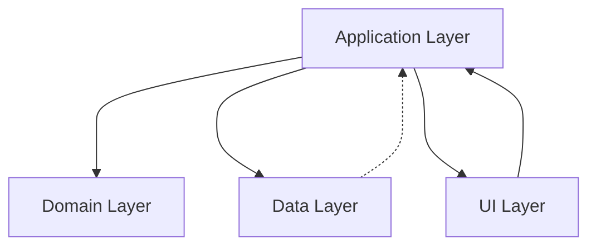

# Intro

## Description

Fridgy is mainly intended to be an android application.
Although it's technically possible to have a working web app available, it's not in the scope of this project.
The mock implementation for web is just used for testing the app locally.

There are currently no plans to port Fridgy to IOS, since the Apple Store forbids projects with GPL licenses.

## Code organization

The main entrypoint of the project is `src/index.html`.

In order to follow the [Law of demeter](https://en.wikipedia.org/wiki/Law_of_Demeter), Fridgy is subdivided in 4 different layers.
Each layer is contained in its own subdirectory and can comunicate with other layers following some rules.

The layers depend on each other following this simple diagram.

The arichitecture is influenced by the [DDD design pattern](https://en.wikipedia.org/wiki/Domain-driven_design) with some other patterns, which will be discussed in the docs of each layer.

Besides those layers, there are a couple more rules that the project follows in order to mantain the code organized.

In the `src/core` subdirectory, there are mostly utilities and helpers which are used all over the project.
You could call it the `Core layer`, and it should not depend on any of the other layers.
In fact, you could possibly put the code in this layer in another library and make this project (and others) depend on it.

## Android

Android specific functionalities are supported through the use of [Capacitor](https://capacitorjs.com/) and a custom-made plugin for creating an sqlite database to hold the data.

The custom plugin is written in Kotlin and is located in the `android/app/src/main/java` directory.

## Tests

Tests are located in the same directory of the tested file and named with a `.test.ts` affix.
This helps to locate them easily and to be aware of missing ones.

Tests make use of [fast-check](https://fast-check.dev/)'s property-based testing.
This allows some of the tests to have a random (seeded) input in order to cover pathological cases, like empty strings or NaN numbers, and so on.
Using this, some tests might be green on one run and red on others, for the same code.
For this reason, a couple of runs are recommended to make sure the tests are green.

Tests are mandatory for core functionalities in the various layers, except for the UI.
The UI layer is notoriously more difficult to test, since it's the most volatile and more dependent on the underlying framework.

This subject will be covered in each layer's specific documentation.
