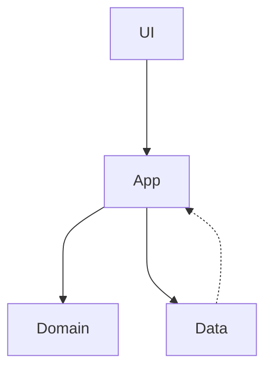

# Intro

## Description

Fridgy is mainly intended to be an android application.  
While a functional web version is technically possible, it's not in the scope of this project.  
The web implementation is provided solely for local testing purposes.

There are currently no plans to port Fridgy to IOS, as the Apple Store does not allow projects licensed under GPL. (afaik)

## The code

### Code organization

The main entrypoint of the project is `src/index.html`.

In order to follow the [Law of demeter](https://en.wikipedia.org/wiki/Law_of_Demeter), Fridgy is divided in 4 different layers.  
Each layer is contained in its own subdirectory and can comunicate with other layers following some rules.

The layers depend on each other following this simple diagram.

The arichitecture is influenced by the [DDD design pattern](https://en.wikipedia.org/wiki/Domain-driven_design) with some other patterns, which will be discussed in the docs of each layer.

`Domain` and `App` represent the heart of the application. `Data` and `UI` are just implementations of that heart.  
As a general rule of thumb, you should be able to rewrite the entire app by just looking at the `Domain` and `App` layers.

The `src/core` directory contains mostly utilities and helpers which are used all over the project.  
You could call it the `Core` layer, and it should not depend on this project at all.  
In fact, you could possibly put `Core` in another library and make this project (and others) depend on it.

Besides those layers, there are a couple more rules that the project follows, in order to mantain the code organized.

### Pure functional programming

The project strives to have a clean code approach when solving problems. This means that the code should be as clean as possible following a [Purely functional programming](https://en.wikipedia.org/wiki/Purely_functional_programming) style, akin to Haskell.  
This is achieved through the use of [Effect](https://effect.website/), and other libraries.

This rule is especially important for the `Domain` and `App` layers, where the core use-cases of the app are defined.  
`Data` and `UI` can be more difficult to adapt, since they depend on external frameworks, architectures and apis. But an attempt should always be made.

### "Making impossible states impossible"

Another important rule is to avoid passing objects that may contain invalid data to functions that should not be responsible for validating such data.  
For example, if you need a type to represent a post description, you wouldn't want to use a simple `string`.  
A `string` could be composed entirely of blank characters or start and end with unnecessary spaces — none of which make sense for a description.  
To ensure consistency, each function receiving that string would then need to validate its correctness, increasing the number of test cases.

Instead, a more appropriate type would be `NonEmptyTrimmedString`, which makes sure that:

1. The string is not empty
2. It's not solely composed of blank characters
3. It's not starting or ending with blank characters (trimmed)

You would then validate and convert a normal string to a `NonEmptyTrimmedString` as soon as possible in the code, in order to avoid precondition checks all around.  
If we then want to allow empty descriptions, we could wrap it in an `Option` type, resulting in `Option<NonEmptyTrimmedString>`.

Another example would be an `age` field of a `Person` type, where `non-positive` or `decimal` numbers shouldn't be allowed.  
Instead, creating a `PositiveInteger` number type would be more appropriate.

You can view a very interesting [video](https://www.youtube.com/watch?v=IcgmSRJHu_8) on a similar subject. Even though it's explained in [Elm](https://elm-lang.org/), the core idea should be clear.

## Android

Android specific functionalities are supported through the use of [Capacitor](https://capacitorjs.com/) and a custom-made plugin for creating an sqlite database to hold the data.

The custom plugin is written in Kotlin and is located in the `android/app/src/main/java` directory.

## Tests

Tests are located in the same directory of the tested file and named with a `.test.ts` affix.
This helps to locate them easily and to be aware of missing ones.

Tests make use of [fast-check](https://fast-check.dev/)'s property-based testing.  
This allows some of the tests to have a random (seeded) input in order to cover pathological cases, like empty strings or NaN numbers, and so on.  
Due to the randomness, some tests may pass during one run and fail during another for the same code. Therefore, it is recommended to run tests multiple times to ensure consistent results.

Tests are mandatory for core functionalities in the various layers, except for the UI.  
The UI layer is notoriously more difficult to test, since it's the most volatile and more dependent on the underlying framework.

This subject will be covered in each layer's specific documentation.
